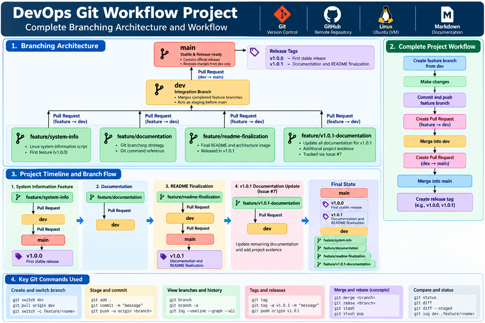

# DevOps Git Workflow Project

A hands-on **Git and GitHub project** demonstrating version-control best practices commonly used in DevOps environments.

This project focuses on structured branching, meaningful commits, Pull Requests, GitHub Issues, release tagging, `.gitignore`, and Markdown documentation.

A small Linux system-information Bash script is used as the practical feature developed through the Git workflow.

<p align="center">
  
</p>

---

## Project Objective

The objective of this project is to manage a DevOps project using Git best practices and demonstrate a clear version-control workflow.

The project covers:

```text
Repository Setup
      ¿
main Branch
      ¿
dev Branch
      ¿
Feature Branch
      ¿
Meaningful Commits
      ¿
Pull Request
      ¿
Merge into dev
      ¿
Pull Request
      ¿
Merge into main
      ¿
Release Tag
```

---

## Key Features

- Git repository initialization
- GitHub remote repository
- `main` stable branch
- `dev` integration branch
- Task-specific `feature/*` branches
- Meaningful commit messages
- Pull Request based merging
- GitHub Issue tracking
- Git release tagging
- `.gitignore`
- Markdown documentation
- Linux Bash scripting
- Release history documentation
- Additional project evidence
- Git workflow architecture documentation

---

## Tech Stack

- **Git**
- **GitHub**
- **Bash**
- **Markdown**
- **Ubuntu Linux**
- **Vagrant**

---

## Repository Structure

```text
devops-git-workflow/
¿
¿¿¿ docs/
¿   ¿¿¿ images/
¿   ¿   ¿¿¿ devops-git-workflow-architecture.png
¿   ¿   ¿¿¿ Additonal-Project-Image-Evidences 
¿   ¿
¿   ¿¿¿ branching-strategy.md
¿   ¿¿¿ git-commands.md
¿
¿¿¿ scripts/
¿   ¿¿¿ system-info.sh
¿
¿¿¿ .gitignore
¿¿¿ CHANGELOG.md
¿¿¿ README.md
```

---

# Git Branching Strategy

The project follows this branching model:

```text
feature/*
    ¿
Pull Request
    ¿
   dev
    ¿
Pull Request
    ¿
  main
    ¿
 Release Tag
```

The three primary branch types are:

```text
main
dev
feature/*
```

---

## `main`

The `main` branch contains stable and release-ready project content.

Responsibilities:

- Contains stable project versions
- Receives changes through Pull Requests
- Used as the source for release tags
- Avoids direct feature development

---

## `dev`

The `dev` branch acts as the integration branch.

Responsibilities:

- Receives completed feature branches
- Combines development work
- Provides a staging point before `main`
- Acts as the source branch for release promotion

---

## `feature/*`

Feature branches are created from the latest `dev` branch.

Examples used during this project:

```text
feature/system-info
feature/documentation
feature/readme-finalization
feature/v1.0.1-documentation
```

Each feature branch focuses on one specific task.

---

# Feature Workflow

The general workflow is:

```text
dev
 ¿
Create feature branch
 ¿
Make changes
 ¿
git add
 ¿
git commit
 ¿
git push
 ¿
Pull Request
 ¿
dev
```

After integrated changes are ready:

```text
dev
 ¿
Pull Request
 ¿
main
 ¿
Release Tag
```

---

# Workflow 1 ¿ System Information Feature

The first practical feature was developed in:

```text
feature/system-info
```

Workflow:

```text
dev
 ¿
feature/system-info
 ¿
Develop system-info.sh
 ¿
Test on Ubuntu Linux
 ¿
Commit
 ¿
Push
 ¿
Pull Request
 ¿
dev
 ¿
Pull Request
 ¿
main
 ¿
v1.0.0
```

This became the first stable release.

---

# Workflow 2 ¿ Documentation

The Git documentation was developed through:

```text
feature/documentation
```

Workflow:

```text
dev
 ¿
feature/documentation
 ¿
Add branching-strategy.md
 ¿
Add git-commands.md
 ¿
Update CHANGELOG.md
 ¿
Commit
 ¿
Push
 ¿
Pull Request
 ¿
dev
```

This demonstrated that documentation changes can follow the same version-control process as application or infrastructure changes.

---

# Workflow 3 ¿ README Finalization

The final README and architecture image were developed through:

```text
feature/readme-finalization
```

Workflow:

```text
dev
 ¿
feature/readme-finalization
 ¿
Finalize README.md
 ¿
Add Git workflow architecture image
 ¿
Commit
 ¿
Push
 ¿
Pull Request
 ¿
dev
 ¿
Pull Request
 ¿
main
 ¿
v1.0.1
```

The resulting release was:

```text
v1.0.1
```

Release message:

```text
Documentation and README finalization
```

---

# Release History

| Version | Description |
|---|---|
| `v1.0.0` | First stable release |
| `v1.0.1` | Documentation and README finalization |

The latest release tag is:

```text
v1.0.1
```

---

## Release `v1.0.0`

The first stable release followed:

```text
feature/system-info
        ¿
   Pull Request
        ¿
       dev
        ¿
   Pull Request
        ¿
       main
        ¿
     v1.0.0
```

Release message:

```text
First stable release
```

---

## Release `v1.0.1`

The README finalization release followed:

```text
feature/readme-finalization
        ¿
   Pull Request
        ¿
       dev
        ¿
   Pull Request
        ¿
       main
        ¿
     v1.0.1
```

Release message:

```text
Documentation and README finalization
```

This release focused on:

- Final README presentation
- Git workflow architecture image
- Project documentation improvements
- Additional project evidence
- Release-ready repository presentation

---

# Post-Release Documentation Alignment

After `v1.0.1` was created, some project documentation still referenced only the earlier `v1.0.0` release.

The remaining documentation work is tracked through:

```text
GitHub Issue #7
```

Issue title:

```text
docs: update project documentation for v1.0.1 release with Additional Project Evidence
```

A dedicated branch was created:

```text
feature/v1.0.1-documentation
```

Current documentation workflow:

```text
Issue #7
   ¿
feature/v1.0.1-documentation
   ¿
Update CHANGELOG.md
   ¿
Update branching-strategy.md
   ¿
Update git-commands.md
   ¿
Update README.md
   ¿
Add / verify project evidence
   ¿
Commit
   ¿
Push
   ¿
Pull Request
   ¿
dev
```

This work documents the existing `v1.0.1` release.

It does **not** move or recreate the existing `v1.0.1` tag.

---

# Pull Request Workflow

## Feature ¿ Dev

Example:

```text
base: dev
compare: feature/system-info
```

Meaning:

```text
Take changes FROM feature/system-info
              ¿
Merge changes INTO dev
```

For the current documentation update:

```text
base: dev
compare: feature/v1.0.1-documentation
```

---

## Dev ¿ Main

After integrated work is ready:

```text
base: main
compare: dev
```

Meaning:

```text
Take changes FROM dev
              ¿
Merge changes INTO main
```

Pull Requests provide a visible and traceable merge history on GitHub.

---

# GitHub Issue Tracking

GitHub Issues are used to track project work that requires additional changes.

The current documentation alignment is tracked using:

```text
Issue #7
```

The related Pull Request can include:

```text
Closes #7
```

This links the Pull Request with the tracked work.

---

# System Information Script

The project includes:

```text
scripts/system-info.sh
```

The script was tested on Ubuntu Linux.

```bash
#!/bin/bash

echo "======================================"
echo "       SYSTEM INFORMATION"
echo "======================================"

echo
echo "Operating System:"
grep PRETTY_NAME /etc/os-release

echo
echo "Kernel Version:"
uname -r

echo
echo "CPU Cores:"
nproc

echo
echo "Memory Information:"
free -h

echo
echo "Disk Usage:"
df -h /

echo
echo "Git Version:"
git --version

echo
echo "======================================"
echo "System information collected"
echo "======================================"
```

Make the script executable:

```bash
chmod +x scripts/system-info.sh
```

Run it:

```bash
./scripts/system-info.sh
```

The script intentionally avoids displaying sensitive information such as:

```text
Passwords
Access Tokens
Private Keys
AWS Credentials
Environment Secrets
```

---

# Meaningful Commit Messages

The project uses clear commit messages instead of generic messages such as:

```text
update
changes
final
done
```

Examples used during the project:

```text
docs: add initial project README

chore: add project gitignore

docs: add project changelog

feat: add system information script

chore: make system info script executable

docs: document Git branching strategy

docs: add Git command reference

docs: update project changelog

docs: finalize README with Git workflow architecture

docs: document v1.0.1 release

docs: update branching strategy for v1.0.1

docs: update Git command reference for v1.0.1
```

---

## Commit Prefixes

| Prefix | Purpose |
|---|---|
| `feat:` | New functionality |
| `fix:` | Bug fix |
| `docs:` | Documentation |
| `chore:` | Maintenance or configuration |
| `test:` | Testing-related changes |
| `refactor:` | Code restructuring |

---

# Git Tagging

Git tags identify stable points in repository history.

Tags used in this project:

```text
v1.0.0
v1.0.1
```

View tags:

```bash
git tag
```

View tag descriptions:

```bash
git tag -n
```

Inspect the latest release:

```bash
git show v1.0.1
```

---

## Historical Tag Commands

First release:

```bash
git tag -a v1.0.0 -m "First stable release"
git push origin v1.0.0
```

README finalization release:

```bash
git tag -a v1.0.1 -m "Documentation and README finalization"
git push origin v1.0.1
```

Published release tags should normally be treated as stable historical references.

---

# `.gitignore`

The project uses `.gitignore` to avoid committing unnecessary or sensitive files.

```gitignore
# Environment files
.env
.env.*

# Logs
*.log

# OS files
.DS_Store
Thumbs.db

# IDE files
.vscode/
.idea/

# Temporary files
*.tmp
*.swp

# Secrets
*.key
*.pem
secrets/
```

Important:

> `.gitignore` prevents untracked files from being added to Git. It does not automatically remove files that have already been committed.

---

# Project Documentation

Detailed project documentation is stored under:

```text
docs/
```

---

## `docs/branching-strategy.md`

Documents:

- `main` branch
- `dev` branch
- `feature/*` branches
- Feature development workflow
- Pull Request workflow
- `v1.0.0` release
- `v1.0.1` release
- Issue `#7`
- Current documentation alignment workflow

---

## `docs/git-commands.md`

Documents:

- Repository initialization
- Remote repository configuration
- Branch management
- Feature branches
- Staging
- Commits
- Push and pull
- Fetch
- Pull Requests
- GitHub Issues
- Merge
- Rebase
- Merge conflicts
- Git stash
- Git tags
- Release history
- Branch comparison
- Branch cleanup

---

# Common Git Commands

Check repository status:

```bash
git status
```

View current branch:

```bash
git branch --show-current
```

View branches:

```bash
git branch
git branch -a
```

Switch branches:

```bash
git switch main
git switch dev
```

Create a feature branch:

```bash
git switch -c feature/<task-name>
```

Stage files:

```bash
git add <file>
```

Commit:

```bash
git commit -m "message"
```

Push:

```bash
git push
```

Pull:

```bash
git pull
```

Fetch:

```bash
git fetch --all
```

View Git history:

```bash
git log --oneline --graph --decorate --all
```

View tags:

```bash
git tag
git tag -n
```

---

# Merge vs Rebase

## Merge

```bash
git merge <branch>
```

Merge combines branch histories.

It may create a merge commit and preserves the original branch history.

---

## Rebase

```bash
git rebase <branch>
```

Rebase moves commits onto another base.

It rewrites commit history.

For this learning project, Pull Request based merges are used because they provide a clear and visible GitHub history.

---

# Merge Conflict Resolution

A merge conflict can occur when Git cannot automatically combine changes.

Typical conflict markers:

```text
<<<<<<< HEAD
Current branch content
=======
Incoming branch content
>>>>>>> branch-name
```

Resolution flow:

```text
Open conflicting file
        ¿
Choose correct content
        ¿
Remove conflict markers
        ¿
git add <file>
        ¿
git commit
```

---

# Git Stash

Temporarily save uncommitted work:

```bash
git stash
```

View saved stashes:

```bash
git stash list
```

Restore the latest stash:

```bash
git stash pop
```

Git stash is useful when switching branches while unfinished changes exist.

---

# Additional Project Evidence

Project evidence can be stored under:

```text
docs/images/
```

The architecture image is stored as:

```text
docs/images/devops-git-workflow-architecture.png
```

Useful additional evidence includes:

```text
GitHub branch structure
Feature ¿ Dev Pull Request
Dev ¿ Main Pull Request
GitHub Issue #7
v1.0.0 tag
v1.0.1 tag
Commit history
System information script execution
Repository structure
```


---

# Git Best Practices Demonstrated

This project demonstrates:

- Keeping `main` stable
- Using `dev` as an integration branch
- Creating task-specific feature branches
- Creating feature branches from the latest `dev`
- Writing meaningful commit messages
- Keeping commits focused
- Using Pull Requests
- Using GitHub Issues to track work
- Linking Issues with Pull Requests
- Using `.gitignore`
- Avoiding secrets in Git
- Using release tags
- Maintaining release history
- Maintaining Markdown documentation
- Testing Bash scripts on Linux
- Managing Git work across Windows and Ubuntu environments

---

# Project Workflow Summary

The complete project history can be represented as:

```text
feature/system-info
        ¿
       dev
        ¿
       main
        ¿
     v1.0.0


feature/documentation
        ¿
       dev


feature/readme-finalization
        ¿
       dev
        ¿
       main
        ¿
     v1.0.1


Issue #7
   ¿
feature/v1.0.1-documentation
        ¿
       dev
        ¿
       main
```

---

# What I Learned

This project helped me practice:

- Git repository initialization
- GitHub repositories
- Local and remote repositories
- Branch creation
- Branch switching
- Feature-based development
- `main` and `dev` branch strategy
- Meaningful commit messages
- Pull Requests
- GitHub Issues
- Branch merging
- Git tags
- Git stash
- Merge conflict concepts
- `.gitignore`
- Markdown documentation
- Linux Bash scripting
- GitHub authentication using a Personal Access Token
- Managing Git across Windows and Ubuntu Linux
- Release documentation
- Version-control workflow planning

---

# Future Improvements

Possible future improvements include:

- Add branch protection rules
- Require Pull Request approvals
- Add GitHub Actions checks
- Add automated validation before merge
- Add a merge-conflict practice scenario
- Add automated release notes
- Practice semantic versioning
- Add signed commits or signed tags
- Add more Linux automation scripts
- Add CI workflow validation

---

# Current Project Status

Latest release:

```text
v1.0.1
```

Release message:

```text
Documentation and README finalization
```

Current documentation maintenance:

```text
Issue #7
```

Development branch:

```text
feature/v1.0.1-documentation
```

The documentation update aligns the repository documentation with the already-created `v1.0.1` release.

---

# Conclusion

This project demonstrates a structured Git and GitHub version-control workflow using:

```text
Git
GitHub
main
dev
feature/*
Commits
Pull Requests
GitHub Issues
Git Tags
.gitignore
Markdown
Bash
```

The primary workflow is:

```text
feature/*
   ¿
Pull Request
   ¿
  dev
   ¿
Pull Request
   ¿
 main
   ¿
release
```

The latest release tag is:

```text
v1.0.1
```

with the release description:

```text
Documentation and README finalization
```

---

## Author

**Ambuj Mishra**

GitHub:

```text
ambujmishra1997
```
